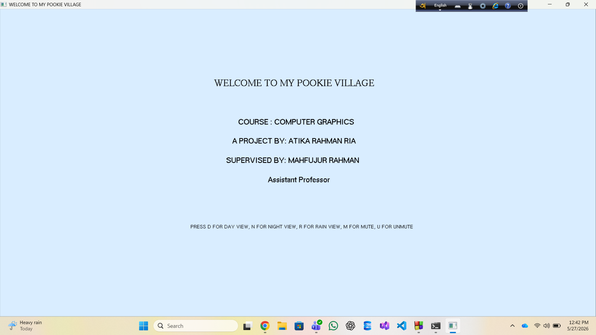
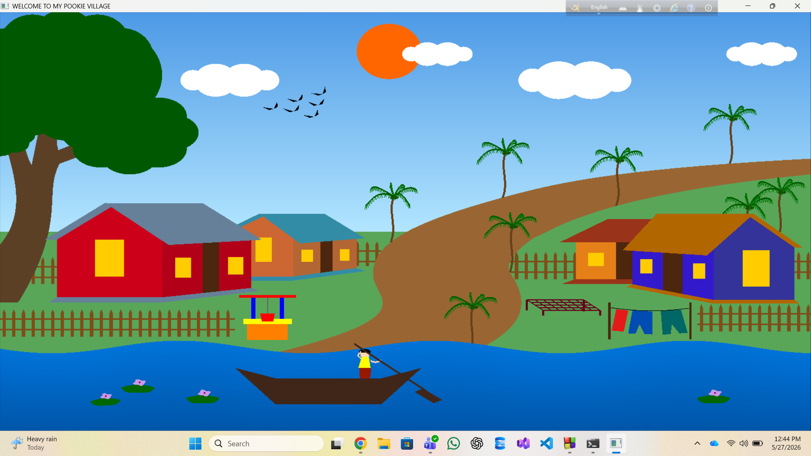
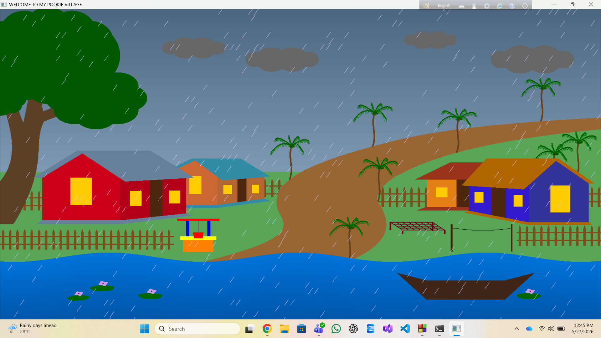
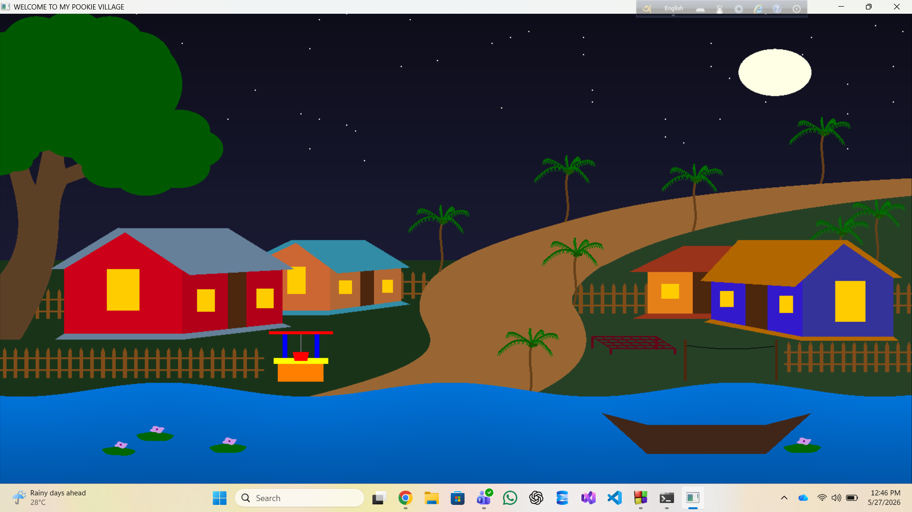
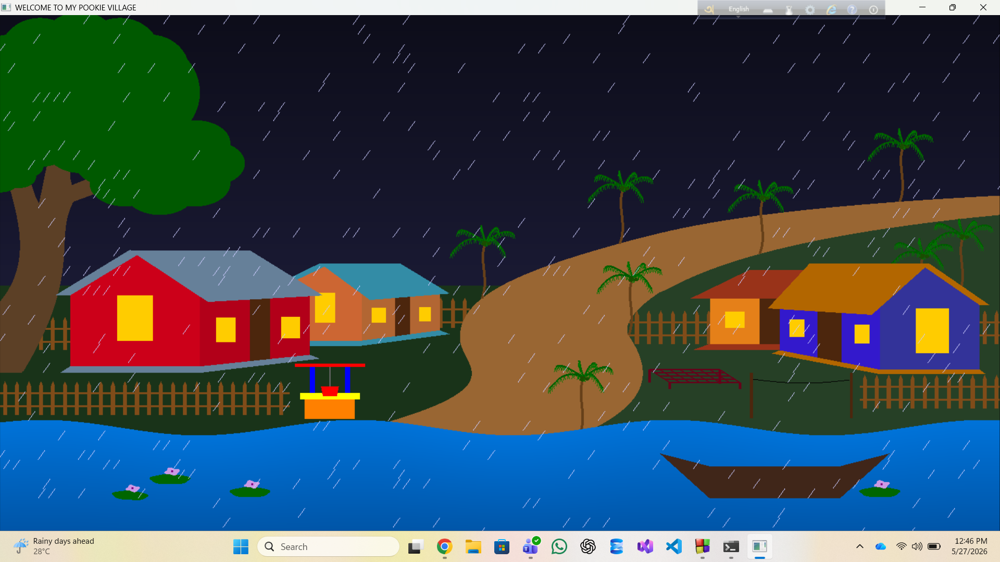

# Welcome to My Pookie Village 🏡

This is an interactive 2D Computer Graphics project built using OpenGL and GLUT in C++. It features a beautiful, dynamic village scenery with multiple environment modes and real-time interactive controls for objects like birds and boats.

---

## 📸 Screenshots & Interactive Modes

Here are the different screens and views available in this application.

### 1. Welcome Screen
*Press any key on startup to enter the village scene.*

### 2. Environmental Views

| Day Mode (D) | Rainy Day Mode (R) |
| --- | --- |
|  |  |

| Night Mode (N) | Rainy Night Mode (R from Night) |
| --- | --- |
|  |  |

---

## 🎮 How To Control (User Instructions)

You can interact with the village using your keyboard and mouse through the following controls:

### 🌅 Environment & Sound Controls (Keyboard)
* **D / d** - Switch to **Day Mode** (Resets rain and night).
* **N / n** - Toggle **Night Mode** (Turns on the moon, stars).
* **R / r** - Toggle **Rain Mode** (Dynamic rain effect over day/night).
* **M / m** - **Mute** background audio.
* **U / u** - **Unmute** and play environmental sound.

### 🦅 Bird Movement Controls (Arrow Keys)
* **↑ (Up Arrow)** - Move birds upward.
* **↓ (Down Arrow)** - Move birds downward.
* **← (Left Arrow)** - Move birds to the left.
* **→ (Right Arrow)** - Move birds to the right.

### ⛵ Boat Navigation Controls (Mouse Clicks)
* **Left Click** - Move the boat from **Left to Right**.
* **Right Click** - Move the boat from **Right to Left**.
* **Middle Click (Scroll Button)** - **Stop** the boat movement.

---

## 📞 Contact

If you have any questions, feedback, or suggestions regarding this project, feel free to reach out!

* **Email:** atikarahmanria@gmail.com
